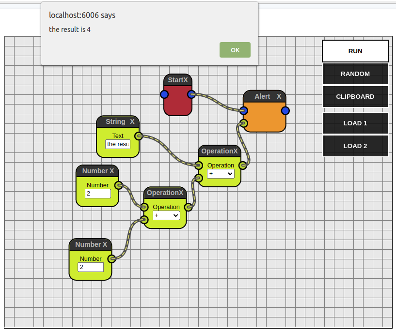

# Wirer

> a flow/node based UI framework for React and JavaScript

## Introduction
**Wirer** is a generalist approach for building user interfaces around the idea of connectable nodes. **Wirer** allows you to customize the UI to better fit your needs via **React** components. You can also create and register your own nodes to achieve the goals of your application and let your users play with it.

## Features
Apart from handling all node dragging interactions, **Wirer** offers the following features:
- [Zoom In and Out](http://ja0n.github.io/wirer/?path=/story/features--zoom)
- [Offset System](http://ja0n.github.io/wirer/?path=/story/features--recenter)

## Examples
Some examples using **Wirer** to interact with external applications:
### Alert
Build the flow to `alert()` a message

[See live](http://ja0n.github.io/wirer/?path=/story/examples--alert)

### Dumb Box
Build the flow to guide a box to the target in a minigame

[See live](http://ja0n.github.io/wirer/?path=/story/examples--dumb-box)

